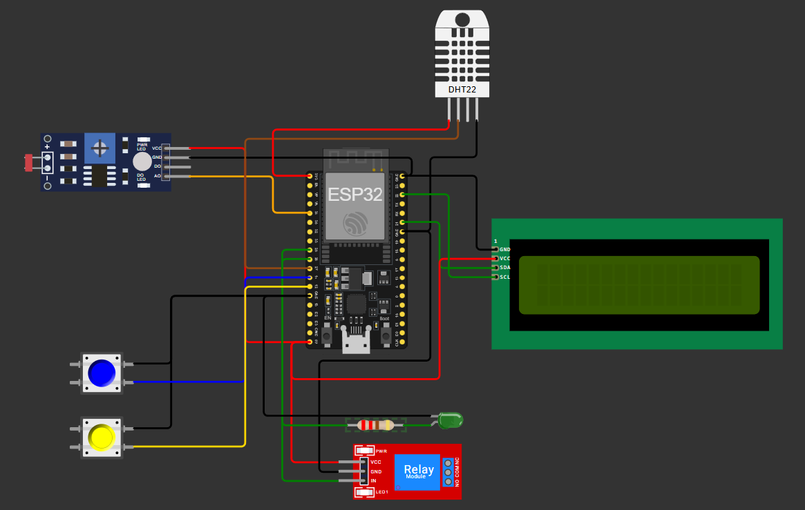
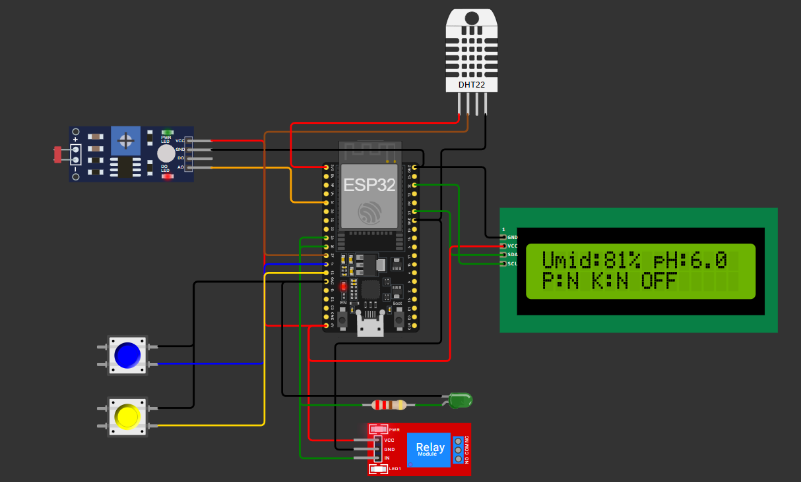
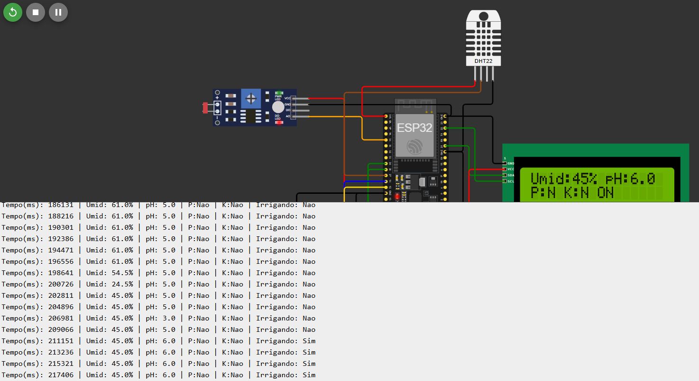
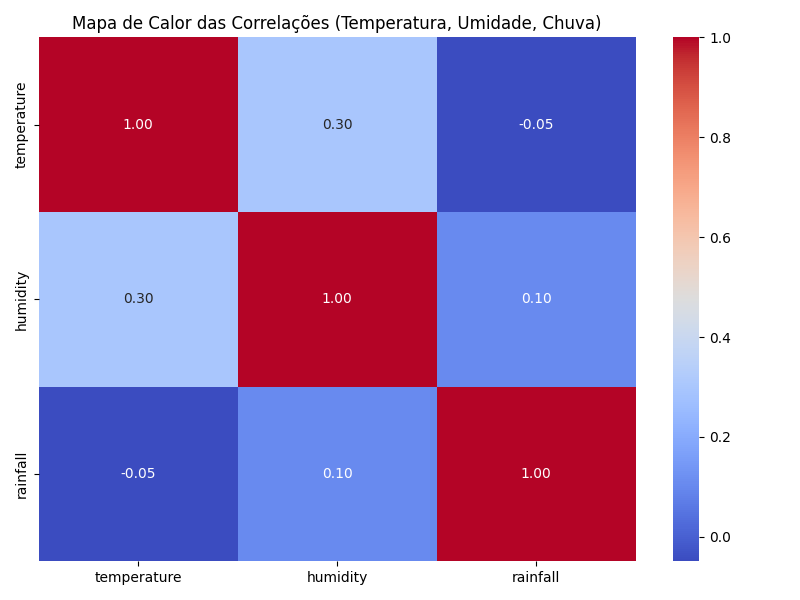
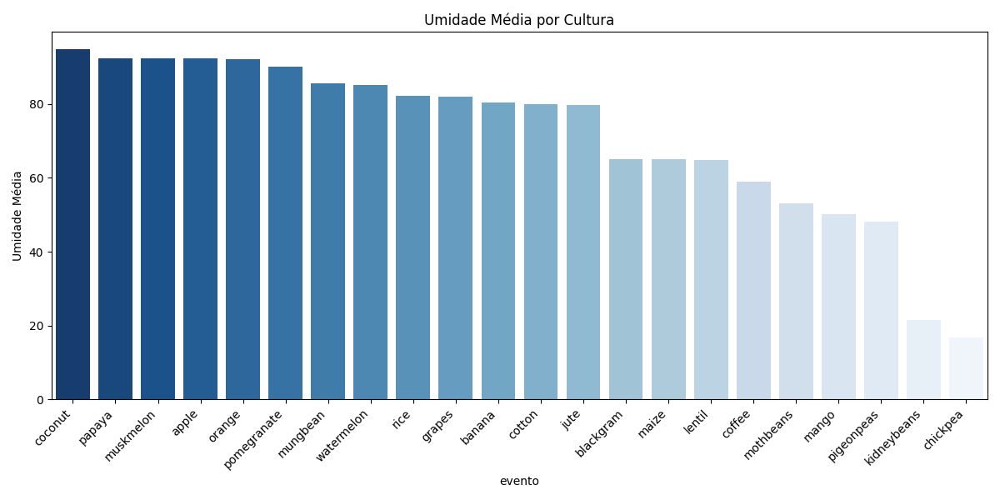
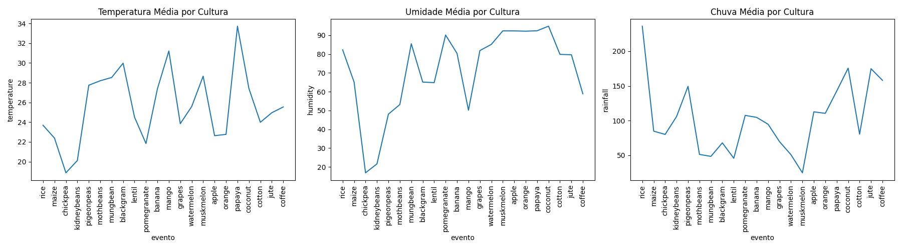
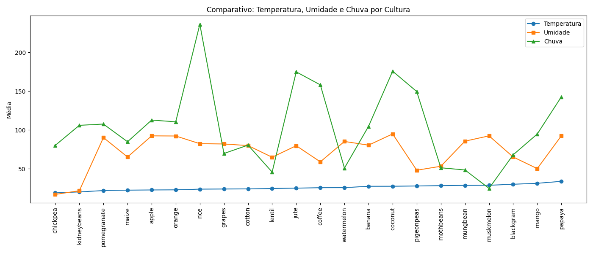
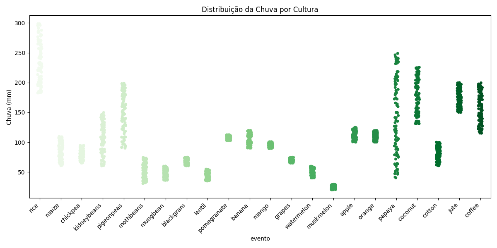
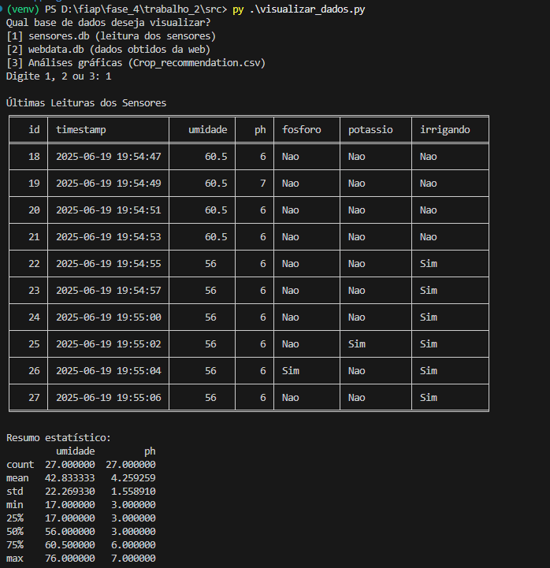

# 🌾 FarmTech Solutions — Sistema Inteligente de Irrigação com Machine Learning

<p align="center">
  <a href="https://www.fiap.com.br/">
    
  </a>
</p>

---

## 📌 Grupo: 37

## 👨‍🎓 Integrantes:
- Thiago Scutari – RM562831 | thiago.scutari@outlook.com  
- Henrique Ribeiro Siqueira – RM565044 | henrique.ribeiro1201@gmail.com  
- Mariana Cavalcante Oliveira – RM561678 | mari.kvalcant@gmail.com  

## 👩‍🏫 Professores:

### Tutor  
- Leonardo Ruiz Orabona  

### Coordenador  
- Andrei Godoi Chiovato  


---

## Descrição do Projeto

Este projeto simula, por meio de sensores virtuais conectados a um ESP32, um sistema inteligente de irrigação agrícola que:

- Lê dados de sensores de umidade, pH, fósforo e potássio;
- Exibe métricas em tempo real em um display LCD I2C;
- Aciona automaticamente uma bomba d’água com base em critérios definidos;
- Armazena os dados em um banco SQLite (`sensores.db`);
- Complementa os dados com informações climáticas simuladas (`webdata.db`);
- Aplica algoritmos de *Machine Learning* para prever a necessidade de irrigação;
- Disponibiliza tudo em um painel Streamlit totalmente interativo.

> 💡 **Destaque:** Este projeto cobre **do hardware simulado à inteligência preditiva**, com registro, visualização, predição e painel integrado. Tudo em um repositório unificado.

---

## Tecnologias e Bibliotecas

| Tecnologia          | Finalidade                              |
|---------------------|------------------------------------------|
| ESP32 + Wokwi       | Simulação do circuito físico             |
| C++ / PlatformIO     | Leitura dos sensores + lógica de controle |
| Python + SQLite     | Banco de dados e processamento de dados |
| Pandas, Seaborn     | Análise estatística e visualização       |
| Scikit-learn        | Aplicação de Machine Learning            |
| Streamlit           | Interface interativa para o usuário      |

---

## Organização do Repositório

```
📦 trabalho_2/
├── docs/                  # Imagens e documentação do projeto
├── src/                   # Códigos-fonte: C++, Python, Streamlit
├── database/              # sensores.db e webdata.db
├── tests/                 # Base simulada: Crop_recommendation.csv
├── README.md              # Este arquivo
└── requirements.txt       # recursos e bibliotecas utilizadas
```
---

## Componentes e Circuito

<p align="center">
  
</p>

### Display LCD em tempo real

| Estado da bomba | Exemplo de leitura |
|-----------------|--------------------|
| **Desligada**   |  |
| **Ligada**      |       |

---

## Monitoramento Serial

<p align="center">
  
</p>

---

## Machine Learning Aplicado

- Simulamos uma base com mais de 4.000 registros.
- Utilizamos:
  - `DecisionTreeClassifier`
  - `RandomForestClassifier`
  - `LogisticRegression`
- Balanceamos os dados com **SMOTE** para evitar viés nos modelos.
- Aplicamos uma **lógica probabilística personalizada** baseada em faixas de temperatura, umidade e chuva para classificar a irrigação (`Sim` / `Não`).

---

## Análise Gráfica dos Dados

### Heatmap de Correlação

<p align="center">
  
</p>

### Umidade Média por Cultura

<p align="center">
  
</p>

### Temperatura / Umidade / Chuva por Cultura

<p align="center">
  
</p>

### Comparativo de Linhas Sobrepostas

<p align="center">
  
</p>

### Distribuição da Chuva

<p align="center">
  
</p>

---

##  Visualização Terminal com Pandas

<p align="center">
  
</p>

---

## 💡 Regras de Acionamento da Bomba de Irrigação

A ativação ou desativação da bomba de irrigação segue uma **lógica híbrida**, combinando regras definidas manualmente com classificações preditivas de Machine Learning.

Abaixo estão as **regras heurísticas utilizadas no projeto**:

### 🌡️ Temperatura
| Faixa (°C)       | Probabilidade de Irrigação |
|------------------|----------------------------|
| 0 – 10           | ❌ 90% NÃO irrigar         |
| 11 – 25          | ✅ 50% SIM irrigar         |
| 26 – 29          | ✅ 60% SIM irrigar         |
| 30 – 32          | ✅ 70% SIM irrigar         |
| Acima de 33      | ✅ 90% SIM irrigar         |

### 💧 Umidade
| Faixa (%)        | Probabilidade de Irrigação |
|------------------|----------------------------|
| 0 – 30           | ✅ 100% SIM irrigar        |
| 31 – 50          | ✅ 70% SIM irrigar         |
| 51 – 80          | ✅ 40% SIM irrigar         |
| 81 – 90          | ❌ 10% SIM irrigar         |
| Acima de 90      | ❌ 99% NÃO irrigar         |

### 🌧️ Chuva
| Faixa (mm)       | Probabilidade de Irrigação |
|------------------|----------------------------|
| 0 – 30           | ✅ 100% SIM irrigar        |
| 31 – 50          | ✅ 70% SIM irrigar         |
| 51 – 100         | ✅ 40% SIM irrigar         |
| 101 – 150        | ❌ 10% irrigar             |
| Acima de 150     | ❌ 99% NÃO irrigar         |

---

### 🧠 Integração com o Modelo de Machine Learning

Estas faixas probabilísticas são **utilizadas como base para geração de rótulos (`Sim` ou `Não`)** no treinamento supervisionado, garantindo que o modelo reflita decisões contextualizadas.

Além disso, a interface em Streamlit permite testar novas combinações de sensores em tempo real com diferentes modelos preditivos.

---

---

## Painel Streamlit

- Interface amigável para prever se a irrigação será ativada com base em:
  - Temperatura (slider)
  - Umidade
  - Chuva
- Escolha do modelo em tempo real;
- Visualização da matriz de confusão.

---

## Nota sobre o projeto

> **Importante:** A Fase 3 não foi entregue anteriormente. Este projeto incorpora **toda a estrutura esperada da Fase 3 + Fase 4**, com:
- Sensoriamento completo;
- Banco de dados e persistência;
- Visualização e análise;
- Predição e Streamlit.

---

## ✅ Conclusões

Este projeto demonstrou de forma prática e integrada o uso de diversas tecnologias para resolver um problema real no contexto da agricultura inteligente:

- **Circuito completo no Wokwi com ESP32**: simulação funcional da leitura de sensores como umidade, pH, fósforo e potássio, além do controle de relé e visualização no display LCD.
- **Persistência de dados com SQLite**: registro contínuo das leituras dos sensores e dos dados obtidos da web, garantindo histórico confiável e acessível para análise futura.
- **Aplicação de Machine Learning**: foram treinados três modelos (Decision Tree, Random Forest e Logistic Regression), todos avaliados com métricas como **acurácia**, **F1-score** e **matriz de confusão**, garantindo previsões consistentes sobre a necessidade de irrigação.
- **Análise exploratória profunda**: gráficos de correlação, médias e distribuições que revelam padrões e comportamentos entre variáveis como temperatura, umidade e chuva em diferentes culturas.
- **Interface interativa com Streamlit**: painel visual onde o usuário pode ajustar os parâmetros dos sensores, escolher o modelo de ML, visualizar os resultados em tempo real e entender a decisão da irrigação com base nas entradas fornecidas.

A junção de hardware simulado, coleta realista de dados, aprendizado de máquina e interface amigável representa um **MVP robusto**, versátil e com forte aplicabilidade no campo do agronegócio.


---

## Referências

- [Wokwi ESP32 Simulador](https://wokwi.com)
- [Scikit-learn](https://scikit-learn.org/)
- [FIAP ON](https://on.fiap.com.br)
- [Kaggle](https://www.kaggle.com/datasets/atharvaingle/crop-recommendation-dataset?resource=download)
- [ChatGPT](https://chatgpt.com/)
---
